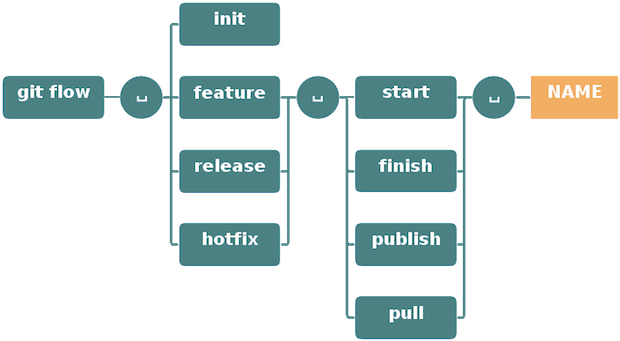

# StackOverflow API - prédiction de Tags

## Phases de développement

### Phase 1 : Socle technique
Création du socle technique : Python, doc, tests

### Phase 2 : API
Développement et déploiement de l'API, CI/CD

### Phase 3 : Prédiction
Mise en place du module de prédiction : modèle mlflow, ui

## Package manager
- Utilisation de Poetry pour gérer les packages dans un environnement virtuel.

## Versionning
- URL : https://github.com/DamSha/stackoverflow-tags-suggest
- Utilisation de GIT flow pour le processus de versionning.
- Utilisation de cz commit pour la mise en forme des commits.

## Suivi de projet
- Utilisation de GitHub Project :
https://github.com/users/DamSha/projects/4

## Documentation
- Git-cliff (https://git-cliff.org/) Génération d'un changelog.md grâce aux commits

## Tests
- Utilisation de Pytest dans le dossier tests/,
- avec Pytest-cov pour la couverture des tests,
- et pytest-xdist pour une éxécution en parallèle


## Git WorkFlow
- Utilisation de Git flow
https://les-enovateurs.com/gitflow-workflow-git-incontournableprojets-de-qualite


## Git Pre-commit
### Installation
- ```poetry add black flake8 isort bandit pre-commit --group dev```
- ```pre-commit sample-config > .pre-commit-config.yaml```
- Modifier [.pre-commit-config.yaml](.pre-commit-config.yaml)
- Installer les pre-commit du fichier config :
- ```pre-commit install```
- Lancer les tests
- ```pre-commit run -a```
### Auto-Update régulier
- ```pre-commit autoupdate```
### Problème ?
- Supprimer le git hooks
- ```pre-commit clean```
- Installer le git hooks
- ```pre-commit install```
- Réinstaller les hooks
- ```pre-commit install --install-hooks```

## Modèle de prédiction
- Routes : /predict
- type : POST
- contenu attendu : { "title": "...", "body": "..." }
- retourne un tableau de tags + précision : [['nom_du_tag', 0.765], ...]

### Artifacts
- [cv.pkl](app%2Fsuggestor%2Fartifacts%2Fcv.pkl) Pour la vectorisation du texte
- [tfidf.pkl](app%2Fsuggestor%2Fartifacts%2Ftfidf.pkl) : Pour la transformation du texte
- [model_supervise_proba.pkl](app%2Fsuggestor%2Fartifacts%2Fmodel_supervise_proba.pkl) :
Modèle supervisé (LinearSVC) + probabilités
